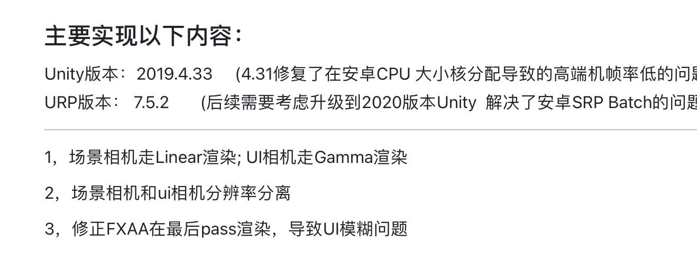

## 主要实现以下内容：

Unity版本：2019.4.33     (4.31修复了在安卓CPU 大小核分配导致的高端机帧率低的问题)  
URP版本： 7.5.2       (后续需要考虑升级到2020版本Unity  解决了安卓SRP Batch的问题) 

-----------------------

1，场景相机走Linear渲染; UI相机走Gamma渲染

2，场景相机和ui相机分辨率分离

3，修正FXAA在最后pass渲染，导致UI模糊问题

[]: 

[你好啊](https://github.com/tkweizhong/CustomURP )

-----------

[CustomURP]: 1.基于  https://github.com/tkweizhong/CustomURP   基础上进行学习及优化

[哇哈哈哈]: https://github.com/tkweizhong/CustomURP

